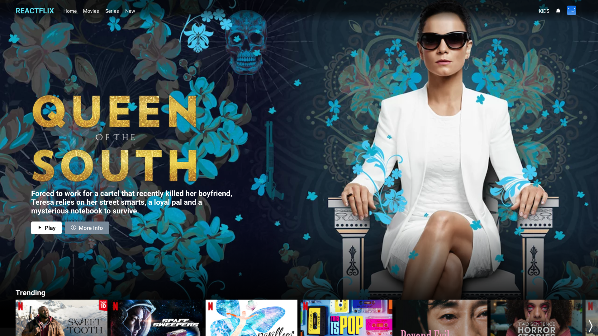
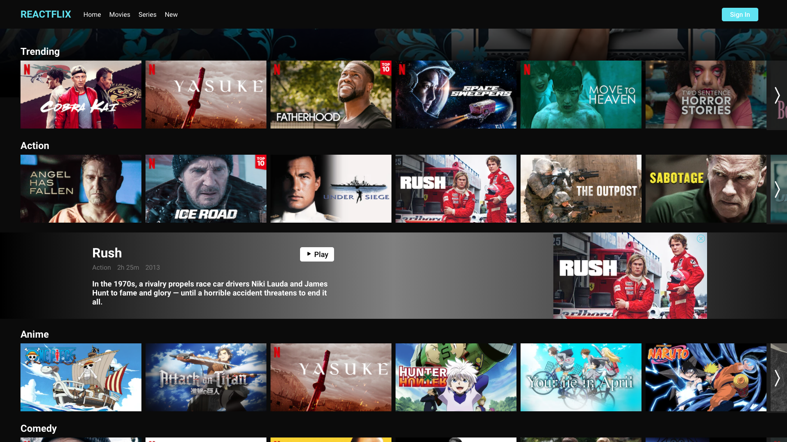
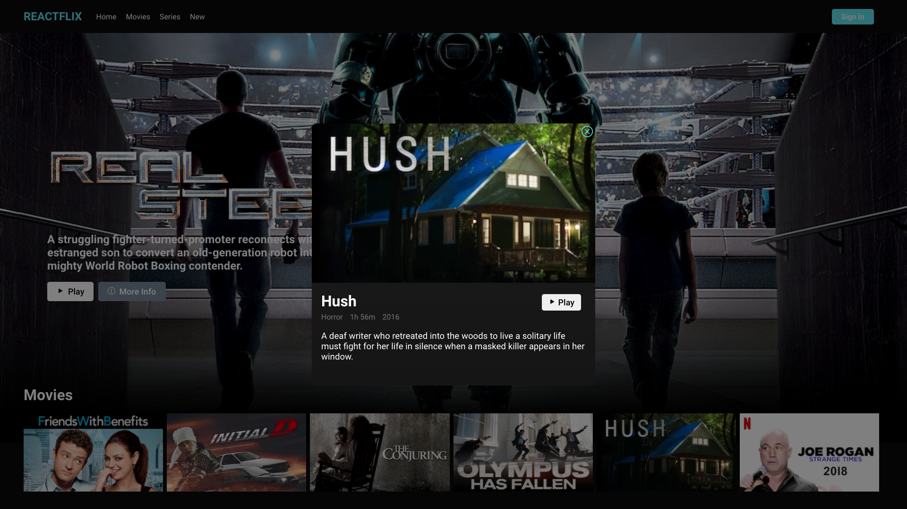
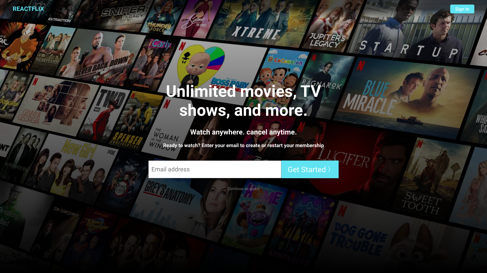
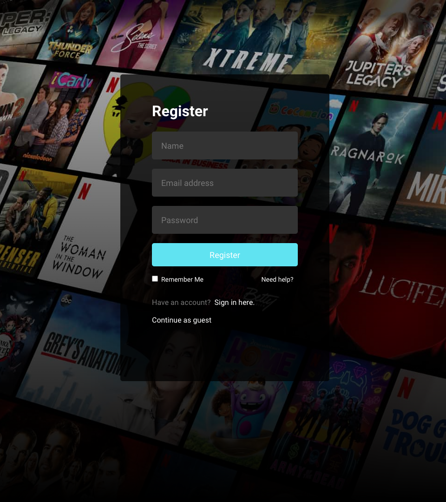
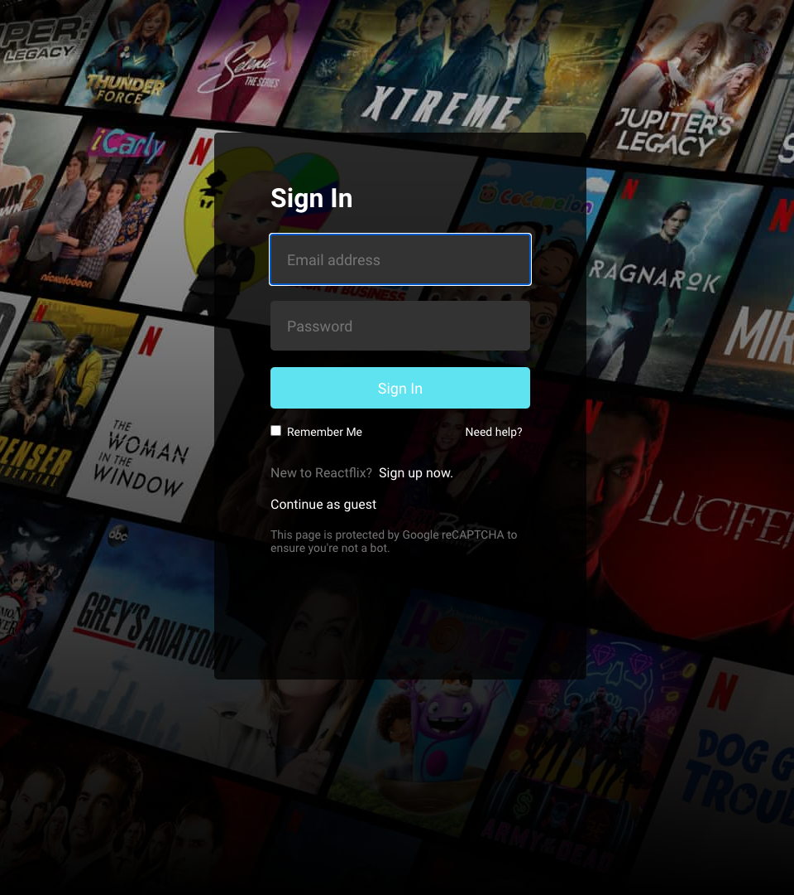

# :computer: Reactflix
Reactflix is a responsive Netflix mockup website that I developed using React, Express, MongoDB and Node, known as the MERN stack. A user can visit the website as a guest and is able to browse through
the collection of movies and series available. The user also has the option to register and sign in or out for a more customizable experience. Reactflix uses bcrypt to encrypt the user's information when stored into the database, and uses json web tokens to create a safe user session. Once signed in, the website creates a cookie in the user's browser and allows the user to stay signed in for 24hs without having to sing back in. While browsing through the collection of films the user can click on any film to see more details about the film such as the title, film duration, release date and a quick description. Reactflix is fully responsive and has support for all platforms with all of the same capabilities.

# :pencil2: What I learned 
* React
* Express
* MongoDB
* HTML/CSS/JS
* Functional Components
* Reach Router
* Json Web Tokens
* Heroku Deployment

# :camera: Screenshots
Browse             
:--------------------------------------------------:

<div align="center">
  <table>
    <tbody>
      <tr>
        <th align="center">Browse Film Info</th>
        <th align="center">Featured Film Info</th>
      </tr>
      <tr>
        <td></td>
        <td></td>
      </tr>
    </tbody>
  </table>
</div>
<div align="center">
  <table>
    <tbody>
      <tr>
        <th align="center">Home</th>
      </tr>
      <tr>
        <td></td>
      </tr>
    </tbody>
  </table>
</div>
<div align="center">
  <table>
    <tbody>
      <tr>
        <th align="center">Register</th>
        <th align="center">Sign In</th>
      </tr>
      <tr>
        <td></td>
        <td></td>
      </tr>
    </tbody>
  </table>
</div>

# :rocket: How to launch
**Install Node and MongoDB**

**Open 3 Terminals**

**1. Reactflix/server/collections**

```brew services start mongodb-community@4.4```

```mongoimport --db reactflixdb --collection films --type json --file films.json```

```mongoimport --db reactflixdb --collection featureds --type json --file featured.json```

**2. Reactflix/**

```npm install express mongoose cors bcrypt dotenv jsonwebtoken cookie-parser```

```node server.js```

**3. Reactflix/client/**

```npm install axios @reach/router```

```npm run start```

**Close Terminals**
1. ```brew services stop mongodb-community@4.4```
2. ```CTRL+C```
3. ```CTRL+C```
